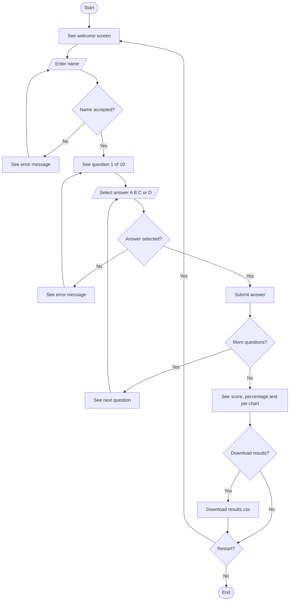
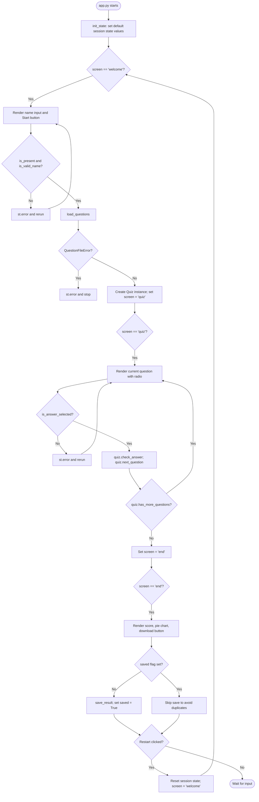

The aim of this project is to develop a Python-based GUI quiz application for internal staff that supports security awareness training through multiple-choice questions, result tracking, and CSV-based data storage.

