## 1. Introduction

As a degree apprentice at IBM UKI Consulting, which in essence covers the whole of the United Kingdom and Ireland consulting practice within IBM, which delivers technology and business consulting to clients across regulated sectors, including financial services, the public sector, and healthcare; our job is to create solutions for our stakeholders' issues. I work in a security team on an 80/20 split of project work and off-the-job work: four days a week on project work and one study day. Having this split has allowed me to gain exposure to the security procedures for IBMers, and also to reflect on my learning from university and apply it to my work.

In an environment of this scale, and one such as IBM, working with clients involves a lot of exposure to client data, and factors such as negligence and human error lead to security incidents. The current training at IBM consists of extensive annual modules that users must complete in a short time frame, and which expect some level of technical ability that is not always the case for some, if not most, IBMers. This is great in terms of being compliant and meeting the regulations and rules of clients and their sectors, but poorly suited for employees who either do not have the right information available to them, or who have so much that it becomes overload and makes no sense. A tool like this, in place of the current IBM quiz or in addition to it, could help address that gap: it offers a quick, topic-specific knowledge check that a team lead could deploy to reinforce a single area such as phishing or password hygiene, without waiting for the next annual training cycle.

This project quiz is a Minimum Viable Product addressing the common areas in which security incidents are prevalent, and the points raised in the SyOps' that IBMers should take into serious consideration. It is a ten-question multiple-choice quiz covering phishing, password hygiene, social engineering, email safety, and breach reporting. Built in Python using the Streamlit framework, the application loads questions from a CSV file, presents them one at a time, validates user input, scores responses, visualises the result, and persists each completion to a downloadable CSV. The scope is deliberately small and simple because it is an MVP, intended to act as a proof-of-concept for how internally-built quizzes and learning tools could be developed within IBM to complement existing training.

## 2. Design

### 2.1 GUI Design

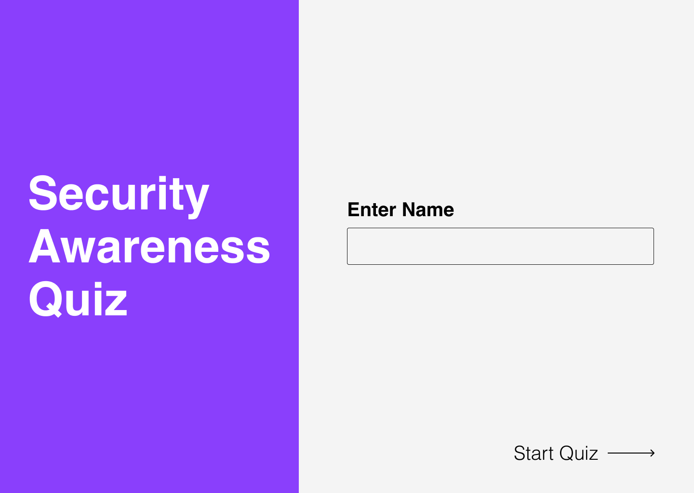
*Figure 1 — Welcome screen. The welcome screen displays a single name input and a 'Start Quiz' button, with the intention to minimise friction and allow staff to have a swift start.*

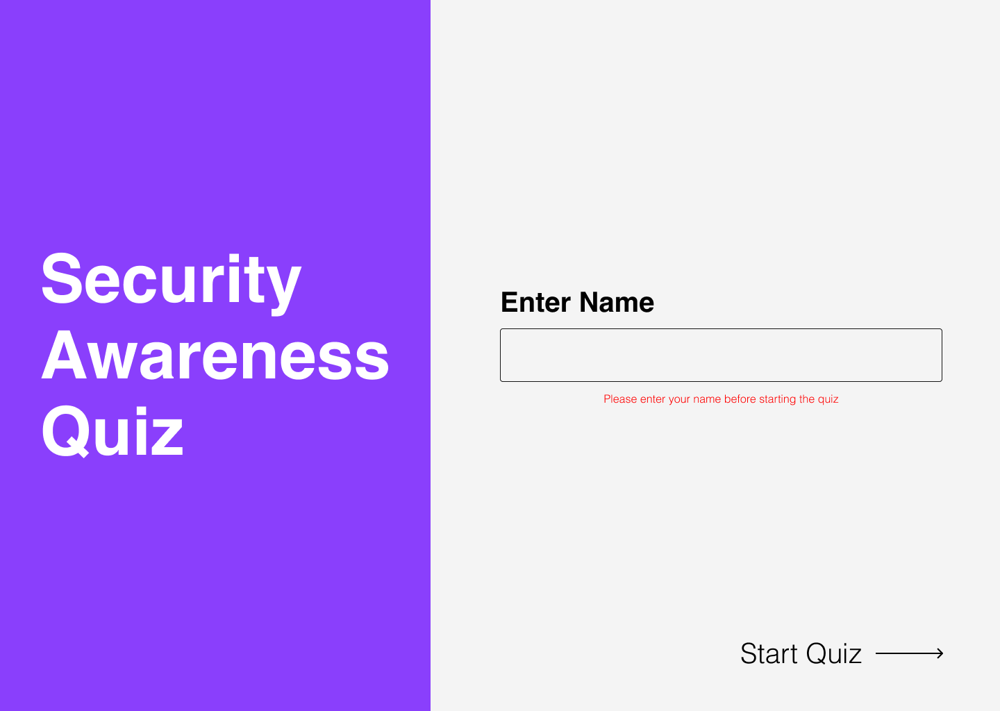
*Figure 2 — Welcome screen with error. On the same page, if the user fails to meet the requirements of putting in a valid name, by either just pressing enter or using the wrong characters, an inline error sign will appear rather than a popup (such as the one you would get if you used tkinter), which is less disruptive and lets users stay in their flow.*

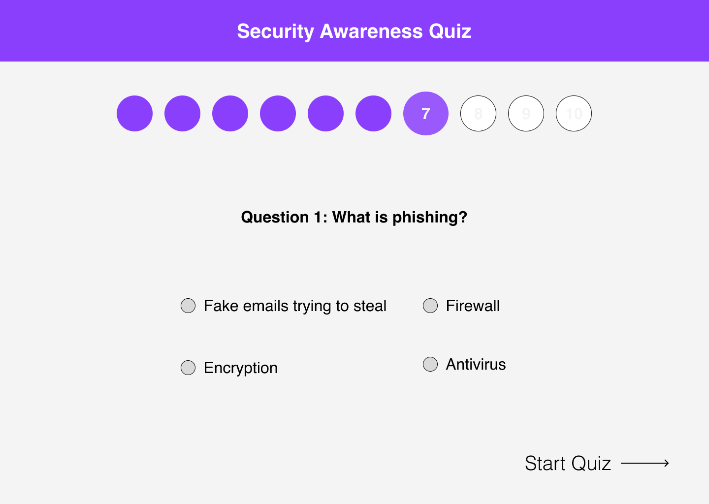
*Figure 3 — Quiz question screen. The quiz question screen was designed with the intent of not overwhelming the user, which is done by presenting one question at a time with four radio button options that are lettered to reduce the risk of confusion, and also a progress bar at the top.*

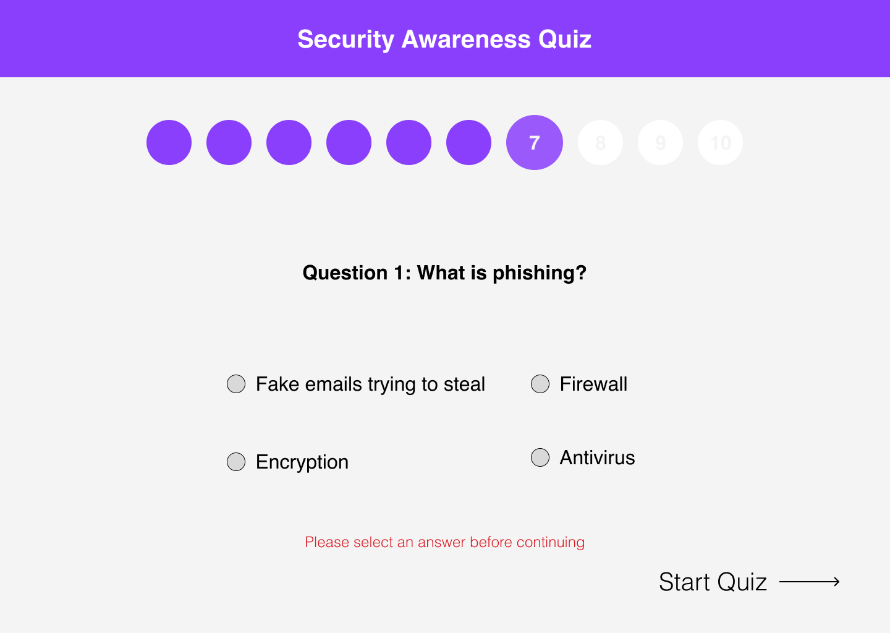
*Figure 4 — Quiz screen with error. The inline error message that appears again on this page is consistent with the errors on the start page, creating a familiar experience and interface for the user.*

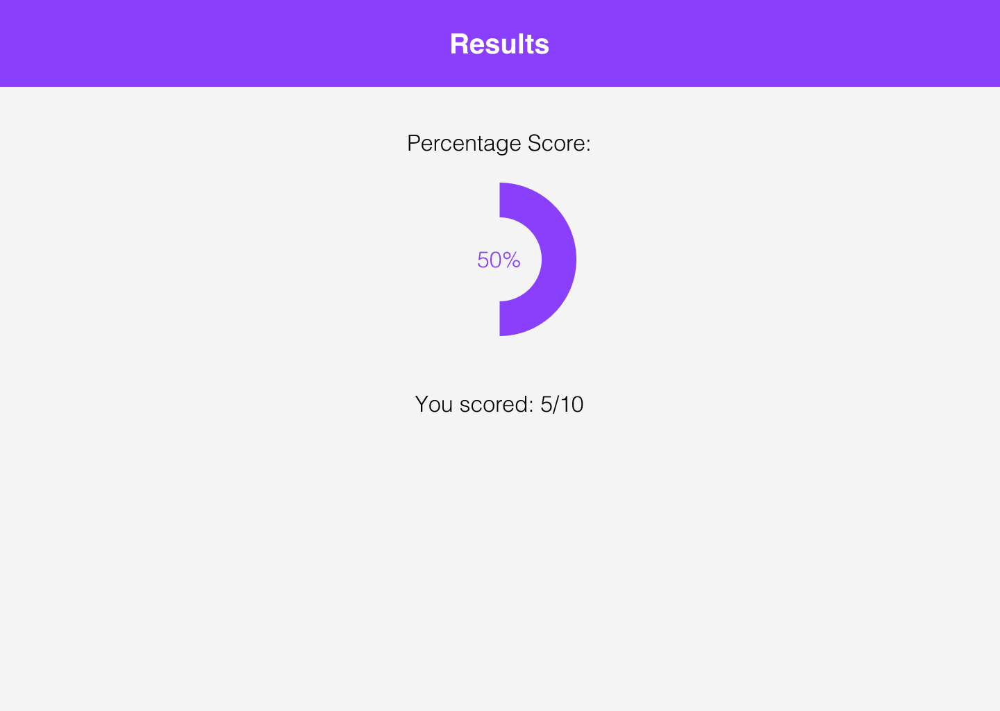
*Figure 5 — End screen. The end screen presents the results in three different ways, as users like to interpret and understand data differently. It is presented as a score, percentage, and pie chart, with download and restart actions co-located underneath so no extra navigation is needed.*

### 2.2 User Journey

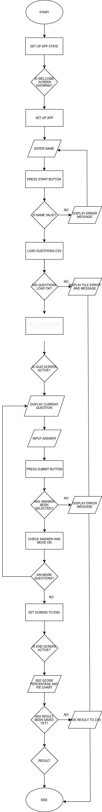
*Figure 6 — User journey flowchart. The user journey flowchart is used to depict the typical experience a user should have throughout the quiz, with three loops: name re-entry on invalid input, question repetition until completion, and optional restart from the end screen.*

### 2.3 Functional Requirements

The system must:

1. Accept a participant's name as text input before the quiz begins
2. Reject empty or invalidly formatted names with a clear, user-facing error message
3. Load all questions from a CSV file on startup
4. Present one question at a time with four multiple-choice options (A, B, C, D)
5. Require the user to actively select an answer before submitting
6. Record the user's selection and increment the score when the answer is correct
7. Visualise the final score as both a numerical percentage and a pie chart
8. Persist the final result (name, score, total, percentage, timestamp) to a CSV file
9. Allow staff to download the cumulative results as a CSV
10. Allow the quiz to be restarted from the end screen
11. Handle missing or malformed input files gracefully, without crashing

### 2.4 Non-functional Requirements

| Category | Requirement |
|---|---|
| Usability | A first-time user can complete the quiz without prior training or written instructions |
| Reliability | The application must not crash on a missing, empty, or malformed `questions.csv` |
| Portability | The application runs on any operating system with Python 3.9 or above |
| Maintainability | All pure functions have associated unit tests; all public functions and classes have docstrings |
| Performance | Screen transitions complete in under one second on a standard laptop |
| Accessibility | The application uses native Streamlit widgets, which support keyboard navigation and screen-reader output |
| Extensibility | New questions can be added by appending rows to `questions.csv`, requiring no code changes |

### 2.5 Tech Stack

| Tool / Library | Purpose | Why chosen |
|---|---|---|
| [Python 3.11](https://www.python.org) | Core language | Mature ecosystem; meets the brief's 3.9+ requirement |
| [Streamlit](https://streamlit.io) | GUI framework | Browser-based UI from a single Python file; lower complexity for an MVP than Flask + HTML/CSS/JS |
| [matplotlib](https://matplotlib.org) | Pie chart visualisation | Native Python plotting; static image suits a one-off result chart better than Plotly's interactive overhead |
| `csv` (standard library) | Persistent storage | Zero infrastructure; human-readable; portable to Excel. SQLite was considered but rejected as overkill for an MVP |
| [pytest](https://docs.pytest.org) | Unit testing | Cleaner assertion syntax than `unittest`; no class boilerplate required |
| [Streamlit Community Cloud](https://streamlit.io/cloud) | Deployment | Free hosting integrated with GitHub; auto-redeploys on push, providing lightweight CI/CD |
| [Figma](https://www.figma.com) | UI prototyping | Industry-standard design tool; shareable collaborative link |
| [Git](https://git-scm.com) / [GitHub](https://github.com) | Version control | Required by the brief; enables CI/CD via Streamlit Cloud |

### 2.6 Code Design

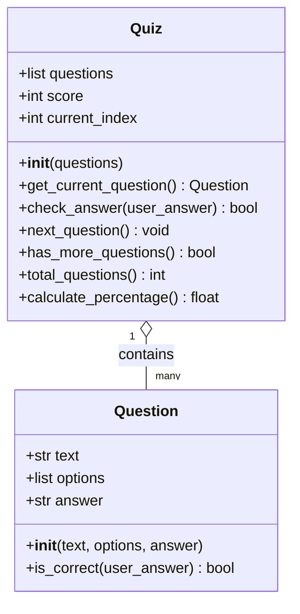
*Figure 7 — Class diagram of the domain model.*

The Question class is the representation of one single multiple-choice question. What it does is store the question, the answer options, and the correct answer, and it provides a method (is_correct) that checks whether a given user answer matches the correct one. The Quiz class, on the other hand, has the role of essentially collecting all the relevant information for the quiz score that you see at the end: the current index, the score you are on, how many are right, what number you are on, incrementing the score, and much more. If I had paired these two classes together, it would have made the whole process easier, as the class would be storing the data of the questions and running the quiz, and it would have limitations on checking correct answers. Whereas using two classes allows us to give each class a singular responsibility, and certain functions can be unit-tested without the need of a Quiz object. It also improves the readability for whoever is reading the code. Neither class depends on Streamlit, CSV files, or any input/output mechanism. This is a deliberate design choice that means the classes can be unit-tested in isolation without launching the app, and the core quiz logic could be reused in a future command-line or Flask version of the app without modification.
## 3. Development

### 3.1 Architecture Overview

For this quiz I have five layered modules. The module that sits at the top of all of them is app.py. This is the main module: it talks to the other four and gathers the information from them. The middle layer, quiz.py and models.py, handles the quiz session and the individual questions within it. Lastly, the final layers sit at the bottom: validation.py handles input validation through pure functions, and storage.py handles reading questions from and writing results to CSV files. Neither bottom layer depends on Streamlit or any of the layers above them, which means they can be unit-tested in isolation without launching the app.
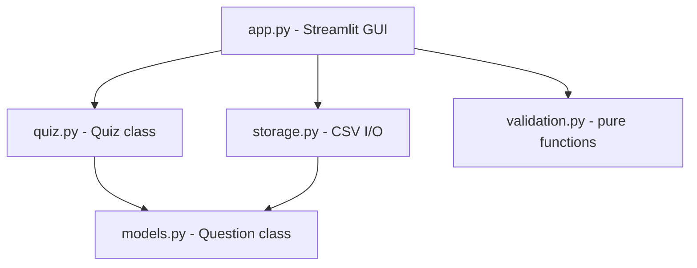
*Figure 8 — Module dependency graph.*

### 3.2 Domain Model — `models.py`

The Question class represents a single multiple-choice question and stores all three pieces of data: the text, the options, and the answer. It provides one method, is_correct, which checks whether a given user answer matches the stored correct answer. The class also uses .upper() to store the correct answer as uppercase. In practice, the selectbox in app.py already restricts the user's answer to 'A', 'B', 'C' or 'D', so the user-side .upper() is mostly redundant. However, the CSV file is hand-editable, so storing the answer as uppercase defends against any future edits to questions.csv where the answer letter might be entered in lowercase. The class has no dependencies on Streamlit or the filesystem, which is what makes it trivially unit-testable in tests/test_models.py

```python
class Question:
    def __init__(self, text, options, answer):
        self.text = text
        self.options = options
        self.answer = answer.upper()

    def is_correct(self, user_answer):
        return user_answer.upper() == self.answer
```

### 3.3 Quiz Session — `quiz.py`

The Quiz's job is to manage the whole quiz session. It holds a list of Question objects and tracks two things during the session: the running score, and which question you are currently on (the current index). When the user submits an answer, the `check_answer` method does not check the answer itself; instead, it asks the current Question to check itself by calling `is_correct`. This is composition: the Quiz has Questions and lets each Question evaluate its own answer, which means the correctness logic only lives in one place. The `calculate_percentage` method also has a small safety net: if there are zero questions, it returns 0 instead of trying to divide by zero, which would otherwise crash the app.

```python
class Quiz:
    def __init__(self, questions):
        self.questions = questions
        self.score = 0
        self.current_index = 0

    def check_answer(self, user_answer):
        if self.get_current_question().is_correct(user_answer):
            self.score += 1
            return True
        return False

    def calculate_percentage(self):
        if self.total_questions() == 0:
            return 0
        return round((self.score / self.total_questions()) * 100, 2)
```

### 3.4 Validation — `validation.py`

A pure function is one where the same input always results in the same output, and it has no other effects on data. Examples of these are present in my `validation.py` module: all three functions are pure, as given the same input they always return the same output. This means each test is just one line: pass an input, check the output. No mocking, no fixtures, no setup. The `is_valid_name` function uses a plain for-loop and `.isalpha()` to check each character. This keeps the implementation at a beginner level, rather than using regex to check whether each character is a letter, space, hyphen, or apostrophe.

```python
def is_present(value):
    return bool(value.strip())


def is_valid_name(name):
    name = name.strip()
    if not name:
        return False
    for character in name:
        if not character.isalpha() and character != ' ' and character != '-' and character != "'":
            return False
    return True


def is_answer_selected(answer):
    return answer in ['A', 'B', 'C', 'D']
```

### 3.5 Storage — `storage.py`

The `storage.py` module has two main roles: loading up the questions from `questions.csv`, and saving each attempt to `results.csv`. It defines two custom exception classes, `QuestionFileError` and `ResultSaveError`, one for each job. Using my own error types means `app.py` only needs to catch one named error per job, instead of guessing between several built-in ones from Python. This is separation of concerns: `storage.py` handles files and raises errors with clear messages, while `app.py` handles the user and shows those messages on screen using `st.error`. The purpose of the `load_questions` function is to check for three specific failures: the file is missing, a required column is missing, or the file is empty. Each failure raises `QuestionFileError` with a message that the GUI then outputs to the user.

```python
class QuestionFileError(Exception):
    """Raised when the questions CSV file cannot be loaded or is malformed."""


class ResultSaveError(Exception):
    """Raised when a quiz result cannot be saved to disk."""
```

### 3.6 GUI — `app.py`
The `app.py` module is in charge of the three state screens: `welcome`, `quiz`, and `end`. Each has its own `if` branch, and transitions happen by setting `st.session_state.screen` to the next screen's name. This is cleaner than using a boolean flag because adding a new screen later is just one more branch, not another flag. Where Streamlit comes in is that it re-runs the entire script from the top every time the user interacts with the page, which is why the `init_state()` function uses `setdefault` to prevent the state from resetting. The `saved` flag is a small but important reliability detail: without it, refreshing the end screen would call `save_result` a second time, duplicating a row in `results.csv`. Guarding on the flag ensures each completion writes exactly one row.

```python
def init_state():
    """Set default values in session state if they are missing."""
    st.session_state.setdefault('screen', 'welcome')
    st.session_state.setdefault('name', '')
    st.session_state.setdefault('quiz', None)
    st.session_state.setdefault('saved', False)
```
---

## 4. Testing

### 4.1 Testing Strategy

The two approaches I used were: automated unit tests for the pure logic, and manual exploratory tests for the Streamlit GUI. The pure functions in `validation.py`, `models.py`, and `quiz.py` can be tested with a single input/output check, with no need to mock the filesystem or session state. The Streamlit GUI in `app.py` is tested manually by walking through the user flow, because Streamlit's full-script re-run model would make automated GUI tests disproportionate for an MVP.

The pure functions were developed with a test-driven mindset. Tests for `is_present`, `is_valid_name`, and `is_answer_selected` were written alongside the implementations rather than after, which forced clean, narrow function signatures that take a single value and return a single result.

I chose [pytest](https://docs.pytest.org) over Python's built-in `unittest` module. pytest uses plain `assert` statements and does not require tests to be wrapped in classes, which keeps the test files shorter, easier to read, and easier for a beginner to maintain.

### 4.2 Manual Test Results

| ID | Scenario | Steps | Expected | Actual | Pass/Fail |
|---|---|---|---|---|---|
| M1 | Empty name | Click "Start Quiz" with blank name field | Error message shown; quiz does not start | As expected | ✅ |
| M2 | Name with numbers | Enter "John123"; click "Start Quiz" | Error message shown; quiz does not start | As expected | ✅ |
| M3 | Hyphenated name accepted | Enter "Mary-Jane"; click "Start Quiz" | Quiz starts on Question 1 | As expected | ✅ |
| M4 | Submit without answer | On Question 1, click "Submit Answer" without selecting | Error message shown; question does not advance | As expected | ✅ |
| M5 | Correct answer scores | Select the correct option; submit | Score increments; advances to next question | As expected | ✅ |
| M6 | Incorrect answer does not score | Select a wrong option; submit | Score unchanged; advances to next question | As expected | ✅ |
| M7 | End screen displays | Complete all 10 questions | Score, percentage, pie chart, and download button visible | As expected | ✅ |
| M8 | Result persisted to CSV | Complete a quiz; open `results.csv` | New row containing name, score, total, percentage, timestamp | As expected | ✅ |
| M9 | No duplicate save on refresh | Complete a quiz; refresh the end screen | Exactly one new row in `results.csv` | As expected | ✅ |
| M10 | Missing questions file | Rename `questions.csv`; restart app; attempt to start a quiz | Friendly error message; application does not crash | As expected | ✅ |
| M11 | Restart resets state | Click "Restart Quiz" on the end screen | Returns to welcome screen; name field cleared | As expected | ✅ |
| M12 | Download button works | Click "Download all results"; check Downloads folder | `results.csv` downloaded containing all rows | As expected | ✅ |

### 4.3 Unit Test Results

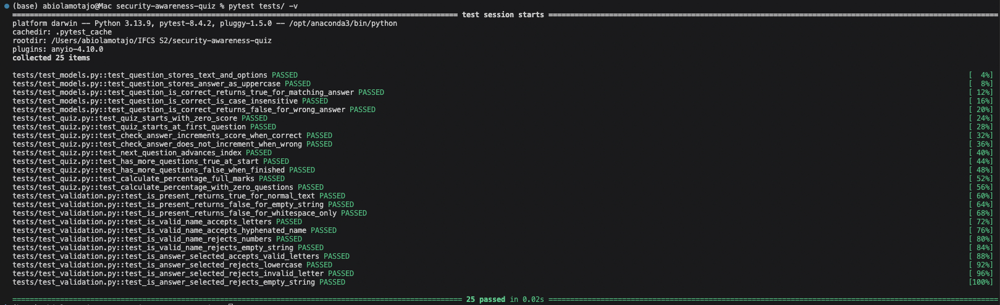
*Figure 9 — Full unit test run. 25 tests across three modules pass in under a second.*

As shown in Figure 9, all 25 tests run and pass in 0.02 seconds. They are being tested across three different files: `tests/test_validation.py` (11 tests), `tests/test_models.py` (5 tests), and `tests/test_quiz.py` (9 tests). Each test file targets its respective module. The validation tests cover edge cases such as typing a name with numbers, leaving the field empty, or using lowercase answer letters, all of which prevent the user from progressing. The model tests cover Question creation and case-insensitive correctness checking. Lastly, the quiz tests cover the structure of the quiz, such as starting on a score of zero and calculating the score correctly throughout.

### 4.4 Reflection on Test Coverage

The `tests/` folder's purpose is to cover the pure logic of my application and contains tests for `validation.py`, `models.py`, and `quiz.py`. On the other hand, `app.py` is only tested whilst the app is being run, by interacting with the quiz rather than through automated tests. The test for saving results is checked by seeing whether the latest attempt was saved to the `results.csv` file once downloaded. Deployment behaviour on Streamlit Community Cloud is also confirmed by a manual smoke test in a browser, rather than through an automated test. A natural extension would be to adopt [Streamlit's testing API](https://docs.streamlit.io/develop/api-reference/app-testing) to bring GUI tests into the automated suite.

## 5. Documentation

### 5.1 User Documentation

The quiz is designed to be used without training. The full user journey takes under three minutes.

**Step 1.** Open the quiz URL in any modern web browser.

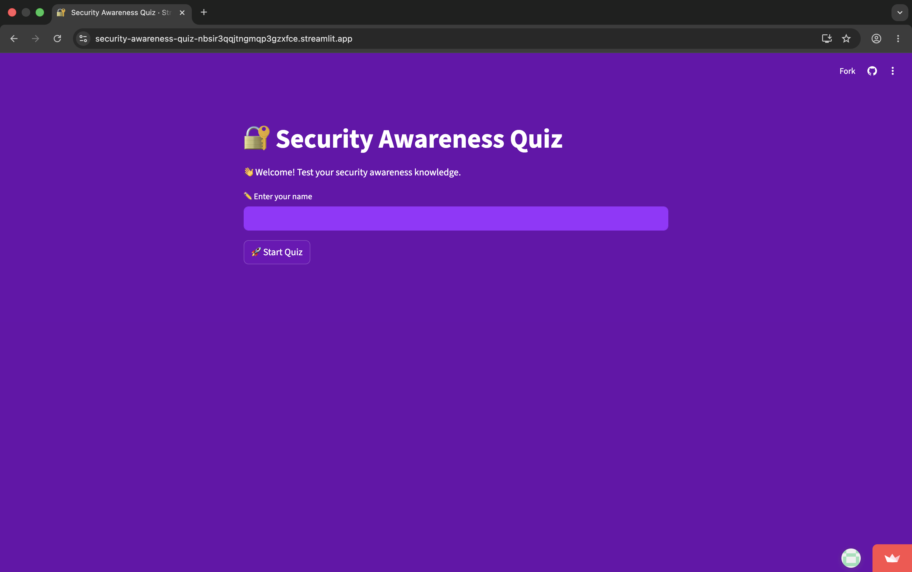

**Step 2.** Enter your full name in the text field and click **Start Quiz**. If the field is left blank or contains numbers or special characters, an error message will appear and the quiz will not start.

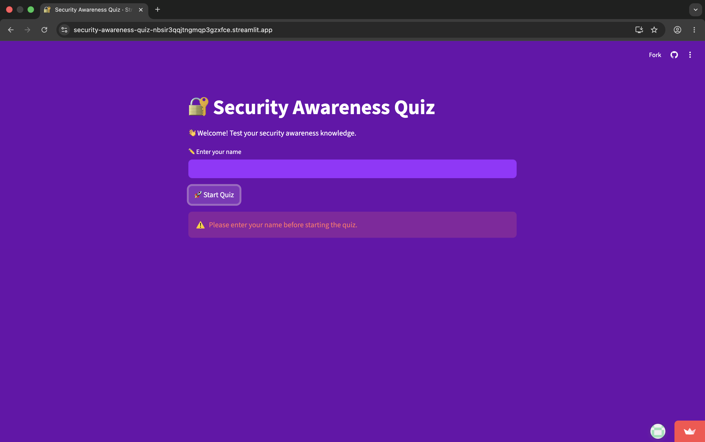
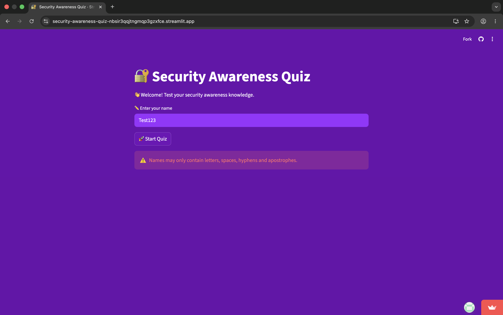

**Step 3.** For each question, read the question text and the four options carefully. Select one option (A, B, C, or D), then click **Submit Answer**. The next question will appear automatically. If you click **Submit Answer** without selecting an option, an inline error will appear and the question will not advance.

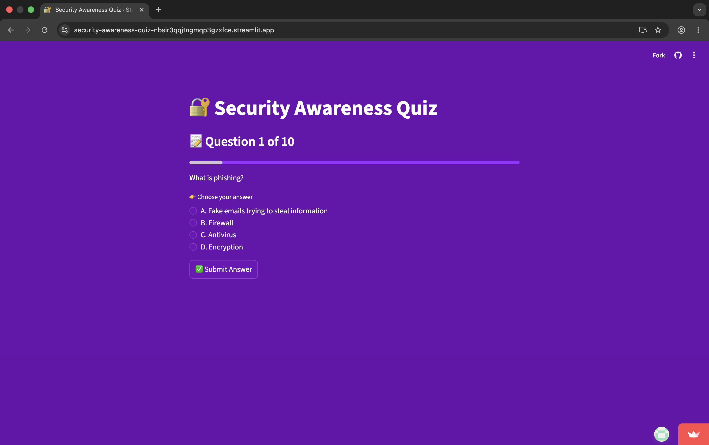
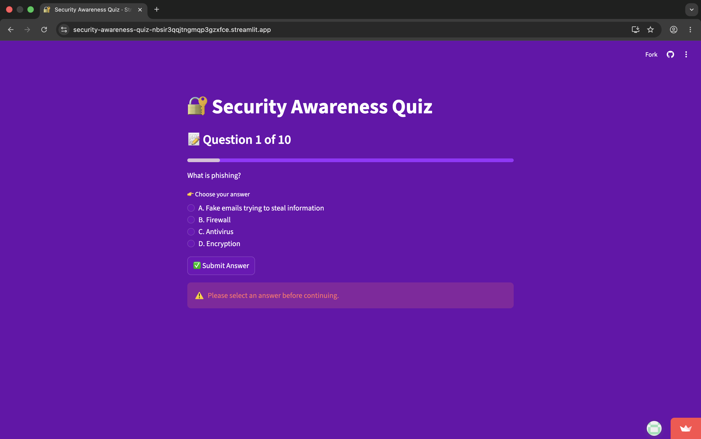

**Step 4.** After ten questions, your final score is displayed alongside a percentage and a pie chart showing the proportion of correct and incorrect answers.


**Step 5.** Managers only: click **Download all results (CSV)** to download the cumulative results file. This contains a row for every completed quiz, including names, scores, and timestamps.

**Step 6.** Click **Restart Quiz** to begin again from the welcome screen.

### 5.2 Technical Documentation

#### Prerequisites

- Python 3.9 or above
- pip
- (Optional but recommended) a virtual environment

#### Running locally

```bash
git clone https://github.com/amotajo/security-awareness-quiz.git
cd security-awareness-quiz
pip install -r requirements.txt
streamlit run app.py
```

The application will open in your default browser at `http://localhost:8501`.

#### Running the test suite

```bash
pytest tests/ -v
```

All 25 tests should pass.

#### Project structure

| File / folder | Purpose |
|---|---|
| `app.py` | Streamlit GUI; screen state machine and event handling |
| `models.py` | `Question` domain class |
| `quiz.py` | `Quiz` session class |
| `storage.py` | CSV read/write and custom exception classes |
| `validation.py` | Pure input-validation functions |
| `tests/` | pytest unit tests for the three core modules |
| `questions.csv` | Quiz content; editable without code changes |
| `results.csv` | Auto-generated log of completed quiz results |
| `requirements.txt` | Python dependencies |
| `assets/` | Figma frames, flowchart, screenshots used in this README |

#### Adding new questions

Append a row to `questions.csv` with the following columns:

| Column | Description |
|---|---|
| `Question` | The question text shown to the user |
| `OptionA` to `OptionD` | The four multiple-choice options |
| `Answer` | The correct option letter (`A`, `B`, `C`, or `D`) |

#### Deployment

The application is deployed on [Streamlit Community Cloud](https://streamlit.io/cloud) and redeploys automatically on every push to the `main` branch. To deploy a new instance, sign in at [share.streamlit.io](https://share.streamlit.io), select the GitHub repository, set the main file path to `app.py`, and click **Deploy**.

---

## 6. Evaluation

### 6.1 What Went Well

[Paragraph — ~100 words. Pick 2-3 specific things that genuinely worked. Examples to draw from: separating pure validation into its own module made testing easy; custom exception classes made the UI error-handling clean; the screen state machine pattern was easier to extend than a boolean flag.]

### 6.2 What Was Harder Than Expected

[Paragraph — ~100 words. Be honest. Examples: Streamlit's full-script re-run model took time to internalise; the duplicate-save bug only surfaced when testing the deployed app and needed the `saved` flag fix; writing GUI tests is genuinely hard and I chose manual testing as a deliberate scoping decision.]

### 6.3 What Could Be Improved

[Paragraph — ~100 words. List 3-4 concrete future improvements. Examples: question randomisation; per-user history would need a database instead of flat CSV; authentication via single sign-on; Streamlit Community Cloud's ephemeral filesystem means results.csv resets on restart — a hosted database would solve this; adopting Streamlit's testing API for GUI coverage.]