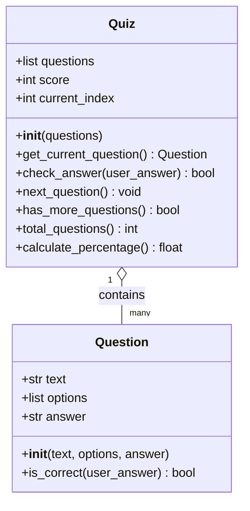

## 2. Design

### 2.1 GUI Design

[Figma screenshot 1 — welcome]
*Figure 1 — Welcome screen. [Your caption.]*

[Figma screenshot 1 — welcome error]
*Figure 1 — Welcome error. [Your caption.]*

[Figma screenshot 2 — quiz]
*Figure 2 — Question screen. [Your caption.]*

[Figma screenshot 2 — quiz error]
*Figure 2 — Question screen error. [Your caption.]*

[Figma screenshot 3 — end]
*Figure 3 — End screen. [Your caption.]*

### 2.2 User Journey

[Your draw.io flowchart PNG]
*Figure 4 — User journey flowchart. [Your caption.]*

### 2.3 Functional Requirements

The system must:
1. Accept a participant's name...
[your existing list]

### 2.4 Non-functional Requirements

[your existing table]

### 2.5 Tech Stack

[your existing table]

### 2.6 Code Design

*Figure 5 — Class diagram of the domain model.*

[Your ~100-word design rationale paragraph here]

The aim of this project is to develop a Python-based GUI quiz application for internal staff that supports security awareness training through multiple-choice questions, result tracking, and CSV-based data storage.

┌──────────────────────────┐
│  Question                │
├──────────────────────────┤
│  + text: str             │
│  + options: list         │
│  + answer: str           │
├──────────────────────────┤
│  + __init__()            │
│  + is_correct(answer)    │
└──────────────────────────┘

┌────────────────────────────────┐
│  Quiz                          │
├────────────────────────────────┤
│  + questions: list[Question]   │
│  + score: int                  │
│  + current_index: int          │
├────────────────────────────────┤
│  + __init__()                  │
│  + get_current_question()      │
│  + check_answer(answer)        │
│  + next_question()             │
│  + has_more_questions()        │
│  + total_questions()           │
│  + calculate_percentage()      │
└────────────────────────────────┘

## 2.3 Functional Requirements

The system must:

1. Accept a participant's name as text input before the quiz begins
2. Reject empty or invalidly formatted names with a clear, user-facing error message
3. Load all questions from a CSV file on startup
4. Present one question at a time with four multiple-choice options (A, B, C, D)
5. Require the user to actively select an answer before submitting
6. Record the user's selection and increment the score when the answer is correct
7. Visualise the final score as both a numerical percentage and a pie chart
8. Persist the final result (name, score, total, percentage, timestamp) to a CSV file
9. Allow staff to download the cumulative results as a CSV
10. Allow the quiz to be restarted from the end screen
11. Handle missing or malformed input files gracefully, without crashing

## 2.4 Non-functional Requirements

| Category | Requirement |
|---|---|
| Usability | A first-time user can complete the quiz without prior training or written instructions |
| Reliability | The application must not crash on a missing, empty, or malformed `questions.csv` |
| Portability | The application runs on any operating system with Python 3.9 or above |
| Maintainability | All pure functions have associated unit tests; all public functions and classes have docstrings |
| Performance | Screen transitions complete in under one second on a standard laptop |
| Accessibility | The application uses native Streamlit widgets, which support keyboard navigation and screen-reader output |
| Extensibility | New questions can be added by appending rows to `questions.csv`, requiring no code changes |

## 2.5 Tech Stack

| Tool / Library | Purpose | Why chosen |
|---|---|---|
| [Python 3.11](https://www.python.org) | Core language | Mature ecosystem; meets the brief's 3.9+ requirement |
| [Streamlit](https://streamlit.io) | GUI framework | Browser-based UI from a single Python file; lower complexity for an MVP than Flask + HTML/CSS/JS |
| [matplotlib](https://matplotlib.org) | Pie chart visualisation | Native Python plotting; static image suits a one-off result chart better than Plotly's interactive overhead |
| `csv` (standard library) | Persistent storage | Zero infrastructure; human-readable; portable to Excel. SQLite was considered but rejected as overkill for an MVP |
| [pytest](https://docs.pytest.org) | Unit testing | Cleaner assertion syntax than `unittest`; no class boilerplate required |
| [Streamlit Community Cloud](https://streamlit.io/cloud) | Deployment | Free hosting integrated with GitHub; auto-redeploys on push, providing lightweight CI/CD |
| [Figma](https://www.figma.com) | UI prototyping | Industry-standard design tool; shareable collaborative link |
| [Git](https://git-scm.com) / [GitHub](https://github.com) | Version control | Required by the brief; enables CI/CD via Streamlit Cloud |
