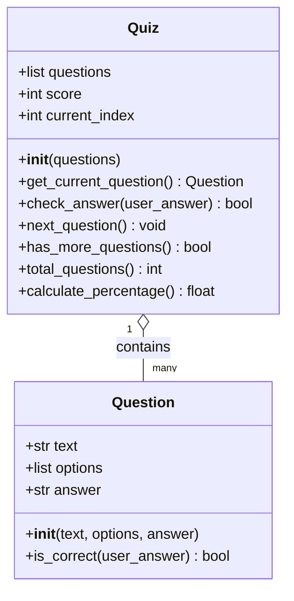

## 1. Introduction

As a degree apprentice at IBM UKI Consulting, which in essence covers the whole of the United Kingdom and Ireland consulting practice within IBM, which delivers technology and business consulting to clients across regulated sectors, including financial services, the public sector, and healthcare; our job is to create solutions for our stakeholders' issues. I work in a security team on an 80/20 split of project work and off-the-job work: four days a week on project work and one study day. Having this split has allowed me to gain exposure to the security procedures for IBMers, and also to reflect on my learning from university and apply it to my work.

In an environment of this scale, and one such as IBM, working with clients involves a lot of exposure to client data, and factors such as negligence and human error lead to security incidents. The current training at IBM consists of extensive annual modules that users must complete in a short time frame, and which expect some level of technical ability that is not always the case for some, if not most, IBMers. This is great in terms of being compliant and meeting the regulations and rules of clients and their sectors, but poorly suited for employees who either do not have the right information available to them, or who have so much that it becomes overload and makes no sense. A tool like this, in place of the current IBM quiz or in addition to it, could help address that gap: it offers a quick, topic-specific knowledge check that a team lead could deploy to reinforce a single area such as phishing or password hygiene, without waiting for the next annual training cycle.

This project quiz is a Minimum Viable Product addressing the common areas in which security incidents are prevalent, and the points raised in the SyOps' that IBMers should take into serious consideration. It is a ten-question multiple-choice quiz covering phishing, password hygiene, social engineering, email safety, and breach reporting. Built in Python using the Streamlit framework, the application loads questions from a CSV file, presents them one at a time, validates user input, scores responses, visualises the result, and persists each completion to a downloadable CSV. The scope is deliberately small and simple because it is an MVP, intended to act as a proof-of-concept for how internally-built quizzes and learning tools could be developed within IBM to complement existing training.

## 2. Design

### 2.1 GUI Design

*Figure 1 — Welcome screen. [Your caption.]*

*Figure 2 — Welcome screen showing the validation error when an invalid name is entered. [Your caption.]*

*Figure 3 — Quiz question screen. [Your caption.]*

*Figure 4 — Quiz screen showing the validation error when no answer is selected. [Your caption.]*

*Figure 5 — End screen with score, percentage, and pie chart. [Your caption.]*

### 2.2 User Journey

*Figure 6 — User journey flowchart. [Your caption.]*

### 2.3 Functional Requirements

The system must:

1. Accept a participant's name as text input before the quiz begins
2. Reject empty or invalidly formatted names with a clear, user-facing error message
3. Load all questions from a CSV file on startup
4. Present one question at a time with four multiple-choice options (A, B, C, D)
5. Require the user to actively select an answer before submitting
6. Record the user's selection and increment the score when the answer is correct
7. Visualise the final score as both a numerical percentage and a pie chart
8. Persist the final result (name, score, total, percentage, timestamp) to a CSV file
9. Allow staff to download the cumulative results as a CSV
10. Allow the quiz to be restarted from the end screen
11. Handle missing or malformed input files gracefully, without crashing

### 2.4 Non-functional Requirements

| Category | Requirement |
|---|---|
| Usability | A first-time user can complete the quiz without prior training or written instructions |
| Reliability | The application must not crash on a missing, empty, or malformed `questions.csv` |
| Portability | The application runs on any operating system with Python 3.9 or above |
| Maintainability | All pure functions have associated unit tests; all public functions and classes have docstrings |
| Performance | Screen transitions complete in under one second on a standard laptop |
| Accessibility | The application uses native Streamlit widgets, which support keyboard navigation and screen-reader output |
| Extensibility | New questions can be added by appending rows to `questions.csv`, requiring no code changes |

### 2.5 Tech Stack

| Tool / Library | Purpose | Why chosen |
|---|---|---|
| [Python 3.11](https://www.python.org) | Core language | Mature ecosystem; meets the brief's 3.9+ requirement |
| [Streamlit](https://streamlit.io) | GUI framework | Browser-based UI from a single Python file; lower complexity for an MVP than Flask + HTML/CSS/JS |
| [matplotlib](https://matplotlib.org) | Pie chart visualisation | Native Python plotting; static image suits a one-off result chart better than Plotly's interactive overhead |
| `csv` (standard library) | Persistent storage | Zero infrastructure; human-readable; portable to Excel. SQLite was considered but rejected as overkill for an MVP |
| [pytest](https://docs.pytest.org) | Unit testing | Cleaner assertion syntax than `unittest`; no class boilerplate required |
| [Streamlit Community Cloud](https://streamlit.io/cloud) | Deployment | Free hosting integrated with GitHub; auto-redeploys on push, providing lightweight CI/CD |
| [Figma](https://www.figma.com) | UI prototyping | Industry-standard design tool; shareable collaborative link |
| [Git](https://git-scm.com) / [GitHub](https://github.com) | Version control | Required by the brief; enables CI/CD via Streamlit Cloud |

### 2.6 Code Design

*Figure 7 — Class diagram of the domain model.*

[Your ~100-word design rationale paragraph here]